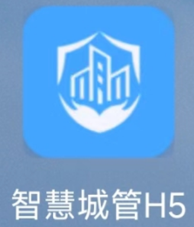

# 公厕、中转站巡查

平台有电脑端和手机端，考虑片长工作实际，下面以手机端为例子说明。

# 安装

下载链接[https://nccg.oss-cn-shenzhen.aliyuncs.com/hm/zhcg.apk](https://nccg.oss-cn-shenzhen.aliyuncs.com/hm/zhcg.apk "https://nccg.oss-cn-shenzhen.aliyuncs.com/hm/zhcg.apk")

# 登录

完成app安装后，在手机中找到下面图标，进入app

## 登录界面

**登录账号：使用者姓名**

**初始密码：zhcg\@123456**

# 主界面

## 进入应用

在首页找到“公厕巡查”模块，如下图所示：

# 公厕巡查

## 开始巡查

点击右上角“创建任务”

创建任务后，进入任务表单，首先选择根据编号搜索，选择巡查的公厕。

填写各项检查项并采集照片后，点击“提交”即完成巡查。

## 注意事项

目前运行阶段，如有异常项，需要手动添加任务截止时间，后续会优化。

## 处理回复异常项

处理回复人，登录系统后，在“待办”栏中可以查看到所有的待办任务。

进入任务工单后，滑动到“异常”项，回复上传处理后照片，点击下方“处理”按钮，选择“提交文档”完成回复操作。

## 申请延期

在任务工单里，点击到下方“处理”按钮，选择“申请延期”，选择时间，填写意见，点击“确认”提交。

## 申请回退

在任务工单里，点击到下方“处理”按钮，选择“申请回退”，填写理由，点击“确认”提交。

# 中转站巡查

中转站巡查，操作逻辑与公厕巡查基本相同，只是检查内容不一样，请参公厕巡查
